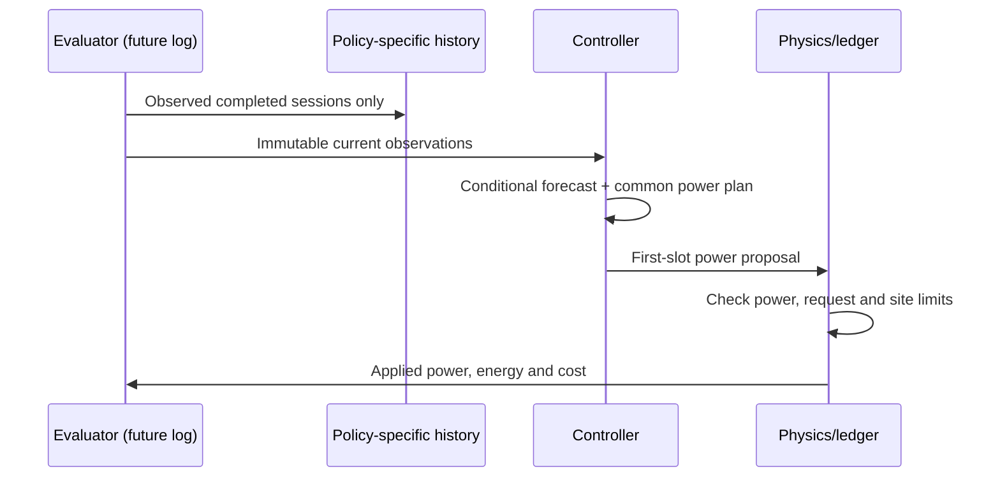

# Method, information timing, and locked protocol

The [diagnostic analyses](diagnostics.md) describe the matched numerical comparisons, later forecast landmarks, and corrected request-update ordering. These exploratory analyses supplement the locked primary study.

## Information contract

`Session` belongs to the evaluator and contains the realized disconnection time. `Observation` is a frozen controller input containing only session/user keys, observed arrival, currently available request/deadline, simulated delivered energy, charger rating, efficiency and completed-session history. It has no realized departure, future arrival list, or future revision list.

At each slot boundary the evaluator processes observed departures and updates history, processes arrivals, selects the latest request available at that boundary, constructs observations, requests a decision, verifies feasibility, and applies energy. Vehicles with no request or no remaining request receive no power. A later request increase can reactivate service. A request decrease never removes energy already delivered. The final valid request before departure defines the denominator; overdelivery is a separate quantity.

Synthetic sessions are already on slot boundaries. The real-data adapter conservatively rounds connection/request availability up and disconnection down. Its same-local-day filter supports daily offline solves. Those restrictions are explicit exclusions, not a correction to the raw records. No actual charger power rating or battery efficiency was obtained from the 26-record sample; numerical physics parameters apply only to the designed experiment.

## Common-plan expectation

Let `x[i,k]` be planned battery energy in kWh in future slot `k`, `eta[i]` charging efficiency, `P[i]` the grid-side charger cap, `C` the grid-side site cap, `q[i]` the current requested energy, `e[i]` the energy already delivered and `r[i]=max(q[i]-e[i],0)`. The plan satisfies

- `0 <= x[i,k] <= eta[i] P[i] Delta`,
- `sum_i x[i,k]/eta[i] <= C Delta` for every future slot,
- `sum_k x[i,k] <= r[i]` for every active session.

Here `Delta=0.25 h`. Capacity reservations apply even if a planned vehicle could depart, making the common plan conservative. Reoptimization releases unused reservations at the next observation. The controller has no arrival model and never sees future arrival records.

Let `A[i,k]` indicate connection at the beginning of slot `k`, conditional on the current observed state, and let `S[i,k]=E[A[i,k]]`. Under fixed planned energy and fixed current request, the total energy before departure is `Y[i]=sum_k A[i,k]x[i,k]`. Since `0<=Y[i]<=r[i]`, the positive-part operation is inactive:

`E[max(r[i]-Y[i],0)] = r[i] - sum_k S[i,k]x[i,k]`.

This identity needs no independence assumption between departures. The hard common capacity restriction is also valid for every realized connected subset. The formula would generally fail if total planned energy could exceed remaining demand, if plans used scenario-specific recourse, or if random revisions changed the denominator inside the horizon. The current implementation replans when revisions are observed but does not forecast revisions.

The implemented objective, dropping constants, is

`min sum_i,k S[i,k] [c[k]/eta[i] - gamma (1+lambda D[user(i)])/q[i]] x[i,k]`.

Prices `c[k]` are dollars per grid kWh. `gamma` is dollars per unit normalized shortfall per session; `lambda` is dimensionless. Expected grid energy and expected service both carry the survival factor. The actual replay bill uses the power truly applied, not the planned expected cost. A tiny `1e-9*k` coefficient favors earlier slots in the initial implementation. The post-primary lexicographic diagnostic finds that this coefficient is too small to reliably resolve solver ties; see the results report. The locked primary implementation is retained for reproducibility, and the stronger tie-break is implemented separately.

There is no scenario Monte Carlo error to average away. Repetition therefore varies generated workloads, not redundant solver seeds. Exact marginal integration is a simplification of this particular surrogate, not an exact solution of the full stochastic control problem. Requests remaining at horizon end incur the same shortfall penalty; no energy is planned after the 24-hour horizon.

## Baseline definitions

| Name | Exact implementation | Forecast input |
|---|---|---|
| `equal` | Capped equal-power water filling, work conserving | None |
| `fcfs` | Arrival-order allocation up to each current cap | None |
| `edf` | Earliest currently stated departure, stable ID tie-break | User-stated deadline |
| `laxity` | Order by median remaining time minus full-power time needed | Calibrated hazard median |
| `maxmin` | Max-min current cumulative fulfillment, limited by slot power | None |
| `debt_share` | Capped water filling weighted by `1+lambda D` | None |
| `point` | Common-plan linear MPC with median deadline | Calibrated hazard median |
| `stochastic` | Common-plan expected-shortfall MPC, `lambda=0` | Full calibrated survival |
| `point_history` | Point MPC with bounded history weights | Calibrated hazard median |
| `history` | Common-plan expected-shortfall MPC with bounded history | Full calibrated survival |
| `pf_mpc` | Same planning constraints, piecewise-log utility of expected normalized cumulative service | Full calibrated survival |

Immediate charging with an equal capacity limiter is exactly the `equal` policy; it is not double-counted as a distinct baseline. The laxity rule is not claimed to reproduce the least-laxity-ratio paper. Debt sharing is an operational history baseline, not an implementation of deficit round robin or a virtual-queue stability theorem.

For `pf_mpc`, `z[i]=(e[i]+sum_k S[i,k]x[i,k])/q[i]`. An auxiliary utility `u[i]` is bounded by the tangent `log(k)-1+z[i]/k` for each knot in `{.02,.05,.1,.2,.4,.6,.8,1}`. Minimizing expected cost minus `gamma sum_i u[i]` gives a concave piecewise-linear approximation to logarithmic utility. It has a finite linear extension near zero; it is not an exact logarithm or an approximation with a proved global error bound at zero. All baselines share physics, sessions and tariff. The history variants receive four validation combinations because they have two tunable coefficients, while ordinary and proportional-fair MPC each receive two; this modest asymmetry favors the candidate and is disclosed.

After a session ends with normalized shortfall `s`, update `D[u]=(1-rho)D[u]+rho*s`. Initialize every policy's state at zero separately at each split/capacity. `rho=.2` is fixed, so weights lie in `[1,1+lambda]`. No deficit entitlement, long-run fairness bound, or repayment claim follows.

## Designed workload

Each seed independently samples user parameters: intended mean stay uniform 5.5–8 hours, baseline request uniform 12–28 kWh, and attendance probability uniform 0.30–0.55. Half the 60 users have dwell noise standard deviation 0.45 hours and half 2 hours. Each site-day shares an additive Gaussian stay disturbance of standard deviation 0.45 hours. Arrival is a rounded Gaussian clock time with mean 08:30 and standard deviation 0.8 hours, clipped to slot indices 27–43. Actual stays are clipped to 1–10.5 hours; requests include 3 kWh Gaussian noise and are clipped to 6–38 kWh. Declared duration adds 0.35-hour noise to intended mean. The six highest user indices enter only after day 109. Each user has a dedicated modeled port, removing admission/queuing effects. These design choices are not calibrated to an empirical distribution.

Workload seeds are 11, 22, 33, 44 and 55. The 140 business-day sequence begins 2025-01-06 in America/Los_Angeles. There are no missing or censored generated records. Days 0–74 train; 75–94 calibrate; 95–109 validate; 110–139 test. Only seed 11 tunes controllers. Each replication fits its own historical model, so this is replication with local training, not strict out-of-site transfer.

A continuous linear charger supplies up to 6.6 kW with efficiency .92. The tariff is a designed $0.12/grid-kWh baseline and $0.30 from UTC 21:00 through 01:00. It is fixed in UTC and is not presented as an actual California utility tariff. Site capacity is each replication's training peak connected nominal power multiplied by .20, .35, .50 or 1.00. The .35 fraction is the primary setting.

## Forecasting

A pooled empirical-duration model conditions on having survived elapsed time. The learned model is a logistic discrete-time hazard with scaled elapsed duration and its square, declared remaining time and overdue duration, arrival hour/weekday, a shrunk prior duration mean/dispersion, prior count and missing-declaration indicator. Logistic regularization `C=1` and maximum 500 iterations are fixed. The complete at-risk rows form the likelihood; they are not balanced by class or inversely weighted by session length. Standardization and population defaults use training only. Personal training-row summaries use preceding completed sessions; later summaries freeze at training end.

A monotone slope/intercept transformation of the logit is fit on calibration data by Bernoulli log loss, with slope in [.1,3] and intercept in [-3,3]. No test data choose calibration parameters. Conditional survival is the product of one minus future slot hazards; current survival is one. Departure probability at 30, 60 and 120 minutes is assessed one hour after request activation among sessions still connected at that landmark. The denominator is reported; results do not describe arrivals that left before that hour. Brier score, binary log loss and reliability bins are saved for empirical, uncalibrated and calibrated models. No claim of universal calibration is made.

## Statistical estimands

For each session, normalized shortfall is `max(1-delivered/requested,0)`. Average first within each user, retain users with at least five test sessions, then average the largest `ceil(.1*N)` user means. Rank separately by policy. Sessions below five remain in aggregate-service denominators. Report the training-defined variable/regular/new groups separately and show dwell/request strata. Failure frequency uses fulfillment below 90%, with 80% and 95% sensitivity.

Primary contrast is candidate minus the locked fair comparator at capacity .35. Negative tail difference favors the candidate. The inferential unit is one entire independently generated population trajectory. Report five paired values and a two-sided 95% t interval with four degrees of freedom; do not bootstrap individual sessions as independent people. Report delivery and cost ratios paired by seed. A claim meeting the practical target requires clear evidence for at least .05 tail reduction and both guardrails; mean-only success is insufficient for a strong claim.

A secondary seed-11 paired block bootstrap resamples contiguous five-day blocks of outcome rows, retains user keys, and recomputes each policy's user tail. This is conditional on fitted models, realized actions and original history state. It does not rerun the controller after moving blocks and may not capture uncertainty in histories or fit. It is a robustness diagnostic rather than the primary interval.

Early/late interventions shift one identity-hashed subset by two hours. Wide/narrow interventions scale forecast spread around a median index by 1.6/.6 and recondition on current survival. The latter need not preserve the conditional median exactly and are not a strict error-parity test. Physical stresses subtract 1.5 hours of dwell (minimum 45 minutes), or multiply requests by 1.25. All use fixed controller parameters. The family is exploratory; absence of an effect does not demonstrate fairness equivalence.
